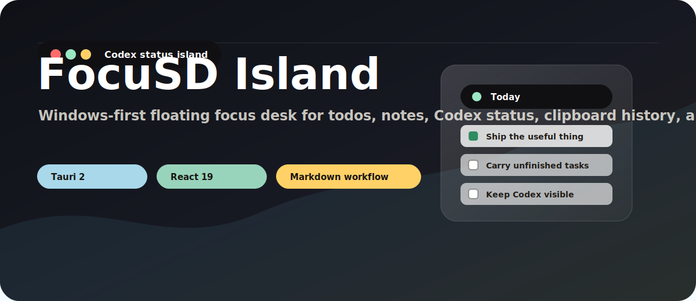

# FocuSD Island

<p align="center">
  
</p>

<p align="center">
  <a href="#项目简介">项目简介</a> ·
  <a href="#核心功能">核心功能</a> ·
  <a href="#部署方式">部署方式</a> ·
  <a href="#常用命令">常用命令</a> ·
  <a href="#english">English</a>
</p>

> 一个 Windows 优先的 Tauri + React 桌面悬浮岛，把今日待办、每日笔记、Codex 状态、剪贴板历史和媒体控制放在屏幕顶部。

<p align="center">
  
</p>

## 项目简介

FocuSD Island 是一个轻量级桌面效率工具。它以透明、无边框、始终置顶的「悬浮岛」形式停靠在主显示器顶部，默认是紧凑胶囊形态，展开后可以管理今日待办、记录每日笔记、回顾归档、查看剪贴板历史、控制媒体播放，并通过 Codex 状态指示灯观察 AI 编程任务是否仍在运行。

项目当前处于早期 MVP 阶段，优先适配 Windows 桌面环境。欢迎通过 Issue 和 PR 一起完善它。

<p align="center">
  
</p>

## 核心功能

| 模块 | 能力 |
| --- | --- |
| 悬浮岛窗口 | 透明、无边框、始终置顶，支持折叠、展开、边缘收起和托盘隐藏。 |
| Codex 状态指示灯 | 可一键安装或修复 Codex hooks，用红、绿、黄状态提示任务运行、完成或需要关注。 |
| 今日待办 | 新增、编辑、完成、删除任务，并可将某个任务设为当前专注任务。 |
| 待办延续 | 可在设置中开启「自动将未完成任务写入下一天」，跨日时自动带入未完成事项。 |
| 待办排序 | 可在设置中开启「允许拖动调整任务顺序」，通过任务右侧把手调整顺序。 |
| 每日笔记 | 记录当天补充信息，与待办一起形成日归档。 |
| Markdown 保存 | 将当天内容保存为 `YYYY-MM-DD.md` 文件，便于接入本地笔记流。 |
| 历史回顾 | 以卡片或时间线方式查看已归档日期。 |
| 剪贴板历史 | 记录文本和图片剪贴板内容，支持快捷键呼出、收藏、复制、删除和清空。 |
| 媒体控制 | 查看系统音频活跃状态，控制播放/暂停、上一首、下一首。 |
| 外观设置 | 调整透明度、缩放、顶部间距、主题颜色，并保存自定义样式预设。 |
| 系统集成 | 支持系统托盘菜单和 Windows 当前用户开机自启动。 |

### Codex 状态指示灯

FocuSD Island 内置 Codex 状态指示灯，适合把 AI 编程任务的运行状态放在桌面最显眼的位置。你可以在设置页一键安装或修复 Codex hooks；当 Codex 正在处理任务时，悬浮岛会显示红色运行状态；任务空闲或完成后回到绿色状态；如果任务失败，或运行标记超过 10 分钟没有收到结束事件，悬浮岛会显示黄色提醒。

<p align="center">
  
</p>

## 部署方式

### 方式一：通过 Release 部署

适合只想直接使用应用的用户。

1. 打开本仓库的 GitHub Releases 页面。
2. 下载最新版本的 Windows 安装包或 release 可执行文件。
3. 推荐优先下载最新版本的 `FocuSD Island_x.x.x_x64-setup.exe` 安装包。
4. 如果下载的是安装包，按提示完成安装；如果下载的是可执行文件，直接运行即可。
5. 首次启动后，可以在设置面板中配置 Markdown 保存目录、开机自启动、Codex 状态指示灯、剪贴板历史和样式预设。

如果 Release 页面暂未提供安装包，请先使用「通过源码部署」方式自行构建。

### 方式二：通过源码部署

适合想参与开发、自己构建可执行文件，或暂时没有可用 Release 包的用户。

#### 环境要求

- Windows 10 / Windows 11
- Node.js
- pnpm
- Rust / Cargo
- Microsoft Visual Studio Build Tools，并安装 C++ 工作负载
- Microsoft Edge WebView2 Runtime

#### 构建步骤

```powershell
git clone <your-repository-url>
cd FocuSD
pnpm install
pnpm tauri build
```

构建完成后，Windows 可执行文件通常位于：

```text
src-tauri/target/release/focusd-island.exe
```

安装包通常位于：

```text
src-tauri/target/release/bundle/nsis/
src-tauri/target/release/bundle/msi/
```

<p align="center">
  
</p>

## 常用命令

| 命令 | 说明 |
| --- | --- |
| `pnpm install` | 安装前端与 Tauri CLI 依赖 |
| `pnpm dev` | 启动 Vite 前端开发服务器 |
| `pnpm build` | TypeScript 检查并构建前端 |
| `pnpm preview` | 预览前端构建产物 |
| `pnpm tauri dev` | 启动 Tauri 桌面开发模式 |
| `pnpm tauri build` | 构建 Tauri 桌面应用和安装包 |
| `pnpm tauri build --no-bundle` | 仅生成 release 可执行文件 |

<p align="center">
  
</p>

## 技术栈

- [Tauri 2](https://tauri.app/)：桌面应用外壳与原生能力
- [React 19](https://react.dev/)：前端界面
- [Vite 7](https://vite.dev/)：前端开发与构建
- [TypeScript](https://www.typescriptlang.org/)：类型约束
- [Rust](https://www.rust-lang.org/)：窗口定位、托盘、文件写入、媒体控制和 Windows API 集成
- [lucide-react](https://lucide.dev/)：界面图标

## 数据与存储

- 待办、每日笔记、归档、外观设置等前端状态默认保存在 `localStorage`。
- 首次使用时，Todo 默认保存路径为用户文档目录下的 `FocuSD` 文件夹。
- 配置保存目录后，今日内容可以写入本地 Markdown 文件，文件名为 `YYYY-MM-DD.md`。
- 剪贴板历史、Codex 状态等原生侧数据保存在应用数据目录中。
- Codex 状态指示灯会读取 `%APPDATA%\com.focusd.island\agent-status.json` 和同目录 marker 文件。
- 开机自启动使用 Windows 当前用户注册表路径：`HKCU\Software\Microsoft\Windows\CurrentVersion\Run`。

## 项目结构

```text
.
├── src/                    # React 前端
│   ├── App.tsx             # 核心 UI、状态和 Tauri invoke 调用
│   ├── App.css             # 主要样式
│   └── main.tsx            # React 入口
├── src-tauri/              # Tauri / Rust 桌面端
│   ├── src/lib.rs          # 原生命令、窗口定位、托盘、媒体和文件保存
│   ├── src/clipboard_history.rs
│   ├── src/main.rs         # Tauri 应用入口
│   ├── capabilities/       # Tauri 权限能力配置
│   └── tauri.conf.json     # Tauri 配置
├── scripts/                # Agent 状态 hook 脚本
├── docs/                   # 文档与 README 视觉资产
├── package.json
└── README.md
```

<p align="center">
  
</p>

## 未来计划

- 开发并适配 macOS 版本。
- 完善安装包发布流程和自动更新能力。
- 增强多显示器定位策略。
- 增加更完整的快捷键与键盘工作流。
- 扩展任务分类、标签和筛选能力。
- 增加数据导入、导出和同步方案。
- 优化剪贴板历史、媒体控制和 Codex 状态指示灯体验。

<p align="center">
  
</p>

## 参与贡献

欢迎提交 Issue 和 Pull Request。

- 发现 Bug：请在 Issue 中说明系统版本、复现步骤、预期行为和实际行为。
- 提出新功能：请描述使用场景，以及它如何帮助保持专注或提升效率。
- 提交 PR：建议保持改动小而清晰，并在说明中写明验证过的命令。
- macOS 适配、Windows 原生能力、Tauri 权限、安全边界、UI 细节优化都非常欢迎。

当前项目仍在 MVP 阶段，很多地方可以一起打磨。

## 许可

当前仓库暂未声明开源许可证。如需公开分发或协作使用，建议补充 `LICENSE` 文件。

---

<a id="english"></a>

<p align="center">
  
</p>

## English

FocuSD Island is a Windows-first Tauri + React floating island for keeping today's tasks, notes, Codex status, clipboard history, and media controls at the top of your screen.

### Core Features

- Transparent, borderless, always-on-top floating island window.
- Todo list with editing, completion, deletion, focus task mode, optional carry-over, and optional drag ordering.
- Codex status light for showing running, completed, or attention-needed states.
- Daily notes, Markdown saving, archive review, clipboard history, media control, tray menu, and launch-at-startup support.

### Deployment

Use the latest Windows installer from GitHub Releases, preferably:

```text
FocuSD Island_x.x.x_x64-setup.exe
```

To build from source:

```powershell
git clone <your-repository-url>
cd FocuSD
pnpm install
pnpm tauri build
```

### Development

```powershell
pnpm dev
pnpm build
pnpm tauri dev
pnpm tauri build
```

Issues and pull requests are welcome.
